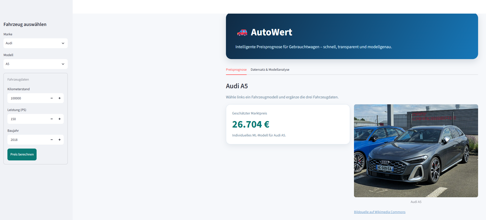
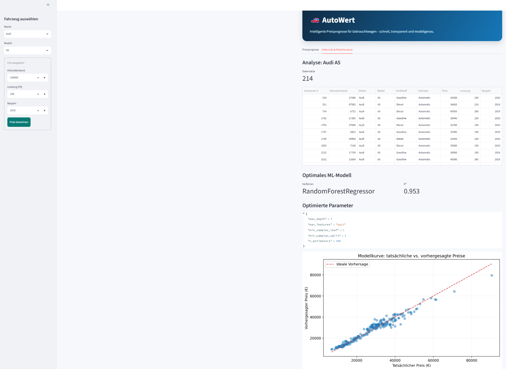

# AutoWert - ML-basierte Gebrauchtwagen-Preisprognose

AutoWert ist eine Python-Anwendung zur Schätzung von Gebrauchtwagenpreisen. Für jede unterstützte Kombination aus **Marke und Modell** wird ein eigenes Regressionsmodell trainiert. Dadurch kann beispielsweise für einen VW Polo ein anderes Verfahren verwendet werden als für einen VW Golf.

Die Anwendung bietet eine moderne Streamlit-Oberfläche für:

- die Auswahl von Marke und Modell,
- die Eingabe von Kilometerstand, Leistung und Baujahr,
- die Berechnung eines geschätzten Marktpreises,
- die Anzeige eines passenden Fahrzeugbildes,
- die Einsicht in den verwendeten Datensatz,
- die Anzeige des optimalen ML-Verfahrens, der optimierten Parameter und des R²-Wertes,
- die Visualisierung tatsächlicher und vorhergesagter Preise.

> **Wichtiger Hinweis:** AutoWert liefert eine datenbasierte Orientierung und keine verbindliche Fahrzeugbewertung. Der tatsächliche Marktpreis hängt unter anderem von Ausstattung, Zustand, Vorbesitzern, regionaler Nachfrage und Unfallhistorie ab.

## Vorschau

### Preisprognose



### Datensatz und Modellanalyse



## Projektziele

Das Projekt untersucht, wie sich Fahrzeugpreise mit klassischen Machine-Learning-Verfahren modellieren lassen. Im Mittelpunkt stehen:

1. eine separate Modellierung für jedes Fahrzeugmodell,
2. ein fairer Vergleich mehrerer Regressionsverfahren,
3. eine reproduzierbare Speicherung der besten Modelle,
4. eine verständliche Darstellung der Ergebnisse in einer Web-App.

## Machine-Learning-Konzept

Für jedes Fahrzeugmodell mit mindestens 50 Datensätzen werden mehrere Verfahren mit `GridSearchCV` optimiert und verglichen:

- Lineare Regression
- Polynomische Regression
- Entscheidungsbaumregression
- Random-Forest-Regression
- Gradient-Boosting-Regression

Als Eingangsmerkmale werden derzeit verwendet:

| Merkmal | Bedeutung |
|---|---|
| `Kilometerstand` | Laufleistung des Fahrzeugs |
| `Leistung` | Motorleistung |
| `Baujahr` | Baujahr beziehungsweise Erstzulassung |

Das Zielmerkmal ist `Preis`.

Für jedes Modell werden die optimierten Vergleichsergebnisse in `car_price_models/model_comparison_results.csv` gespeichert. Der jeweils beste Estimator wird als eigene `.joblib`-Datei abgelegt.

### Qualitätskriterien

Ein Fahrzeugmodell wird in der App nur berücksichtigt, wenn:

- mindestens **50 Datensätze** vorhanden sind,
- eine gültige Modelldatei gefunden wird,
- der gespeicherte Gesamt-R²-Wert **größer als 0,6** ist.

Der R²-Wert wird im Analysebereich zusätzlich anhand der Vorhersagen für das ausgewählte Fahrzeugmodell berechnet und angezeigt. Ein R²-Wert von 1,0 entspricht einer perfekten Erklärung der beobachteten Preisvariation; negative Werte oder Werte nahe 0 weisen auf eine geringe Modellgüte hin.

## Datenbasis

Die Rohdaten stammen aus dem Kaggle-Datensatz [Germany Cars Dataset](https://www.kaggle.com/datasets/kalyankumarm/germany-cars-dataset). Im Projekt werden unter anderem folgende Spalten verwendet:

`Kilometerstand`, `Marke`, `Model`, `Kraftstoff`, `Getriebe`, `Preis`, `Leistung`, `Baujahr`

Die Datei `data/autoscout24-germany-dataset_cleaned.csv` ist die bereinigte Trainingsgrundlage. Die Datenaufbereitung entfernt unter anderem:

- die nicht benötigte Spalte `Typ`,
- Einträge der Marke `Others`,
- Zeilen mit fehlenden Werten,
- Duplikate,
- unplausible Einträge mit `Leistung == 1`.

## Systemanforderungen

- Python 3.10 oder neuer
- Windows, macOS oder Linux
- ausreichender Arbeitsspeicher für mehrere Grid Searches
- Internetzugang für die optionale Bildsuche über Wikimedia Commons

## Installation

### 1. Repository klonen

```bash
git clone https://github.com/vasilesirbu95/machine_learning_car_price_prediction_Python.git
cd machine_learning_car_price_prediction_Python
```

### 2. Virtuelle Umgebung erstellen

Windows PowerShell:

```powershell
python -m venv .venv
.\.venv\Scripts\Activate.ps1
```

Windows Eingabeaufforderung:

```bat
python -m venv .venv
.venv\Scripts\activate.bat
```

macOS/Linux:

```bash
python3 -m venv .venv
source .venv/bin/activate
```

### 3. Abhängigkeiten installieren

```bash
python -m pip install --upgrade pip
pip install -r requirements.txt
```

Die zentrale Anwendung benötigt insbesondere `pandas`, `scikit-learn`, `joblib`, `matplotlib`, `requests` und `streamlit`. Das Repository enthält zusätzlich Notebook- und Datenimport-Abhängigkeiten.

## Anwendung starten

Vor dem Start müssen folgende Dateien vorhanden sein:

```text
data/autoscout24-germany-dataset_cleaned.csv
car_price_models/*.joblib
car_price_models/model_comparison_results.csv
```

Danach wird die Streamlit-App aus dem Projektstamm gestartet:

```bash
streamlit run main/streamlit_app.py
```

Die Anwendung ist anschließend normalerweise unter folgender Adresse erreichbar:

```text
http://localhost:8501
```

Falls Port 8501 bereits verwendet wird:

```bash
streamlit run main/streamlit_app.py --server.port 8502
```

### Bedienung der App

1. In der Seitenleiste eine **Marke** und ein **Modell** auswählen.
2. Kilometerstand, Leistung und Baujahr eingeben.
3. Auf **Preis berechnen** klicken.
4. Im Reiter **Preisprognose** den geschätzten Marktpreis und das Fahrzeugbild ansehen.
5. Im Reiter **Datensatz & Modellanalyse** Datensätze, Verfahren, R², Parameter und Modellkurve prüfen.

Die Fahrzeugbilder werden bei Bedarf über die Wikimedia-Commons-API gesucht. Die Bildquelle wird in der App verlinkt. Da Wikimedia-Inhalte von verschiedenen Nutzern stammen, kann für einzelne Modelle kein passendes Bild gefunden werden.

## Daten importieren und bereinigen

Der optionale Kaggle-Import befindet sich in `data/api_download_dataset_kaggle.py`.

Für den Kaggle-Download wird eine persönliche API-Konfiguration benötigt. Die Datei darf nicht in das Repository eingecheckt werden:

```text
Windows: C:\Users\<Benutzername>\.kaggle\kaggle.json
Linux/macOS: ~/.kaggle/kaggle.json
```

Danach kann der Import über das Notebook ausgeführt werden. Die Funktion lädt den Datensatz herunter; `data/dataset_cleaning.py` bereinigt ihn und erzeugt die Datei mit dem Suffix `_cleaned.csv`.

> **Sicherheit:** Niemals API-Tokens, Passwörter oder `kaggle.json` committen oder veröffentlichen.

## Modelle neu trainieren

Der Trainingsworkflow ist im Notebook `main/main.ipynb` dokumentiert. Das Notebook erkennt den Projektstamm automatisch und importiert die Module aus `data/` und `main/`.

Der zentrale Trainingsaufruf entspricht:

```python
from main.model_training import train_and_save_models

training_summary = train_and_save_models(
    df,
    output_dir="car_price_models",
    features=["Kilometerstand", "Leistung", "Baujahr"],
    target="Preis",
    min_samples=50,
)
```

Der Trainingslauf:

1. gruppiert den Datensatz nach `Marke` und `Model`,
2. überspringt Gruppen mit weniger als 50 Einträgen,
3. führt für jede Gruppe mehrere Grid Searches aus,
4. wählt das Verfahren mit dem höchsten Gesamt-R²,
5. speichert genau ein individuelles `.joblib`-Modell pro Modellvariante,
6. schreibt alle Vergleichsergebnisse in `model_comparison_results.csv`.

Die neuen Dateinamen sind kollisionssicher, zum Beispiel:

```text
Mercedes-Benz_A_180_ml.joblib
Mercedes-Benz_A_200_ml.joblib
Volkswagen_Golf_ml.joblib
Volkswagen_Polo_ml.joblib
```

Nach einem neuen Training sollte die Streamlit-App neu geladen werden. Bei gecachten Daten kann in Streamlit zusätzlich **Clear cache** beziehungsweise **Rerun** verwendet werden.

## Projektstruktur

```text
.
├── data/
│   ├── api_download_dataset_kaggle.py
│   ├── dataset_cleaning.py
│   ├── autoscout24-germany-dataset.csv
│   └── autoscout24-germany-dataset_cleaned.csv
├── main/
│   ├── main.ipynb
│   ├── model_training.py
│   └── streamlit_app.py
├── car_price_models/
│   ├── *_ml.joblib
│   └── model_comparison_results.csv
├── requirements.txt
└── README.md
```

### Wichtige Dateien

| Datei | Zweck |
|---|---|
| `main/streamlit_app.py` | Streamlit-Oberfläche, Preisprognose und Analyse |
| `main/model_training.py` | Grid Search, Modellvergleich und Speicherung |
| `main/main.ipynb` | Interaktiver Daten- und Trainingsworkflow |
| `data/dataset_cleaning.py` | Bereinigung des Rohdatensatzes |
| `data/api_download_dataset_kaggle.py` | Optionaler Kaggle-Download |
| `car_price_models/*.joblib` | Gespeicherte individuelle Modelle |
| `model_comparison_results.csv` | Vergleich aller Verfahren und R²-Werte |

## Fehlerbehebung

### `ModuleNotFoundError: No module named 'data'`

Das Notebook sollte aus dem Projektstamm oder über Jupyter geöffnet werden. Prüfe außerdem, dass die Ordner `data/` und `main/` direkt unterhalb des Projektstamms liegen. Die aktuelle Notebook-Version sucht den Projektstamm automatisch.

### `OSError: Could not find kaggle.json`

Der optionale Kaggle-Import benötigt eine gültige API-Datei im Benutzerverzeichnis. Alternativ kann die bereits vorhandene bereinigte CSV-Datei direkt verwendet werden; dann ist kein erneuter Download notwendig.

### Es werden keine Modelle angezeigt

Prüfe:

1. ob `data/autoscout24-germany-dataset_cleaned.csv` vorhanden ist,
2. ob `car_price_models/` die `.joblib`-Dateien enthält,
3. ob `model_comparison_results.csv` vorhanden ist,
4. ob die jeweiligen Modellgruppen mindestens 50 Datensätze haben,
5. ob der R²-Wert größer als 0,6 ist.

### Die Preisprognose schlägt fehl

Stelle sicher, dass Marke und Modell eine passende `.joblib`-Datei besitzen und dass die Eingabewerte numerisch sowie innerhalb der zulässigen Bereiche liegen. Nach Änderungen an Modellen oder Vergleichsdateien die App neu laden.

## Reproduzierbarkeit und Grenzen

Die Hyperparameter-Suche verwendet feste Zufallszustände, soweit dies für die eingesetzten Verfahren möglich ist. Die Ergebnisse hängen trotzdem von Datensatzversion, Bibliotheksversion, Datenbereinigung und Hardware ab.

Die Modelle verwenden aktuell nur drei numerische Merkmale. Informationen wie Kraftstoffart, Getriebe, Ausstattung, Fahrzeugzustand und regionale Lage werden nicht direkt modelliert. Die Anwendung ist daher ein Demonstrator und kein vollständiges professionelles Bewertungssystem.

## Lizenz und Quellen

- Datengrundlage: [Kaggle - Germany Cars Dataset](https://www.kaggle.com/datasets/kalyankumarm/germany-cars-dataset)
- Fahrzeugbilder: [Wikimedia Commons](https://commons.wikimedia.org/)
- Streamlit: [streamlit.io](https://streamlit.io/)
- scikit-learn: [scikit-learn.org](https://scikit-learn.org/)

Bitte die Lizenzbedingungen des Datensatzes und der jeweils verwendeten Bilder beachten.

## Autor

**Vasile Sirbu**
Masterstudent Fahrzeugtechnik, TU Berlin
Schwerpunkt: Datenanalyse, Machine Learning und Automotive
